* https://mp.weixin.qq.com/s/fU-AeaPz-lHlg0CBgqnpZQ

### 1、基本卷积运算

* 手工设计轻量化模型主要思想在于设计更高效的“网络计算方式”（主要针对卷积方式），从而使网络参数减少，并且不损失网络性能。本节概述了CNN模型（如MobileNet及其变体）中使用的基本卷积运算单元，并基于空间维度和通道维度，解释计算效率的复杂度。

#### 1.1 标准卷积

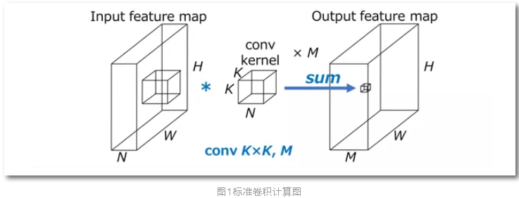

* HxW表示输入特征图空间尺寸（如图1所示，H和W代表特征图的宽度和高度，输入和输出特征图尺寸不变），N是输入特征通道数，KxK表示卷积核尺寸，M表示输出卷积通道数，则标准卷积计算量是HWNK²M。
* 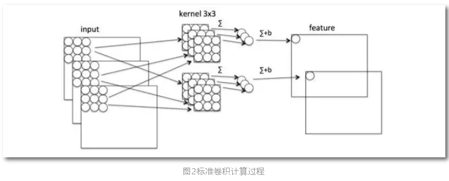
* 如图3所示标准卷积在空间维度和通道维度直观说明（以下示意图省略“spatial“，”channel“，”Input“，”Output“），输入特征图和输出特征图之间连接线表示输入和输出之间的依赖关系。以conv3x3为例子，输入和输出空间“spatial”维度密集连接表示局部连接；而通道维度是全连接，卷积运算都是每个通道卷积操作之后的求和(图2)，和每个通道特征都有关，所以“channel”是互相连接的关系。

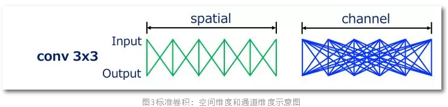

#### 1.2 Grouped Convolution

* 分组卷积是标准卷积的变体，其中输入特征通道被为G组(图4)，并且对于每个分组的信道独立地执行卷积，则分组卷积计算量是HWNK²M/G，为标准卷积计算量的1/G。

* Grouped Convlution最早源于AlexNet。AlexNet在ImageNet LSVRC-2012挑战赛上大显神威，以绝对优势夺得冠军，是卷积神经网络的开山之作，引领了人工智能的新一轮发展。但是AlexNet训练时所用GPU GTX 580显存太小，无法对整个模型训练，所以Alex采用Group convolution将整个网络分成两组后，分别放入一张GPU卡进行训练（如图5所示）。

#### 1.3 Depthwise convolution

* Depthwise convolution 最早是由Google提出，是指将NxHxWxC输入特征图分为group=C组(既Depthwise 是Grouped Convlution的特殊简化形式)，然后每一组做k*k卷积，计算量为HWK²M（是普通卷积计算量的1/N，通过忽略通道维度的卷积显著降低计算量）。Depthwise相当于单独收集每个Channel的空间特征。

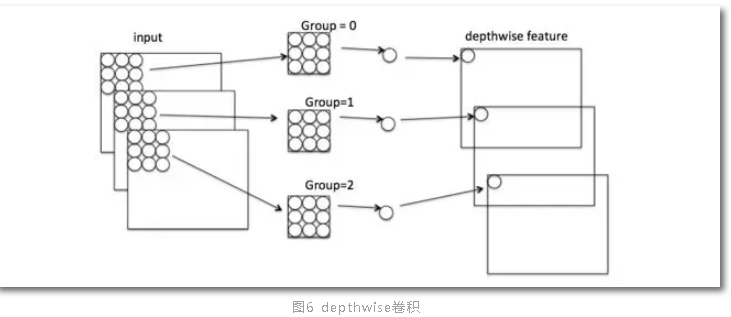

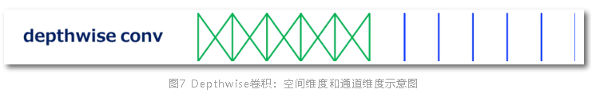

#### 1.4 pointwise convolution

* Pointwise是指对NxHxWxC的输入做 k个普通的 1x1卷积，如图8，主要用于改变输出通道特征维度。Pointwise计算量为HWNM。

* Pointwise卷积相当于在通道之间“混合”信息。

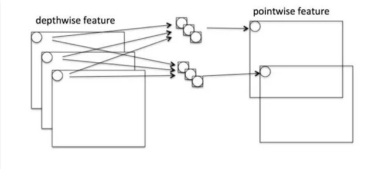

#### 1.5 Channel Shuffle

* Grouped Convlution导致模型的信息流限制在各个group内，组与组之间没有信息交换，这会影响模型的表示能力。因此，需要引入group之间信息交换的机制，即Channel Shuffle操作。

* Channel shuffle是ShuffleNet提出的（如图 5 AlexNet也有Channel shuffle机制），通过张量的reshape 和transpose，实现改变通道之间顺序。

  

### 2、人工设计神经网络

* MobileNet V1&V2,ShuffleNet V1&V2有一个共同的特点，其神经网络架构都是由基本Block单元堆叠，所以本章节首先分析基本Block架构的异同点，再分析整个神经网络的优缺点。

#### 2.1 MobileNet V1

* MobileNet V1是Google第一个提出体积小，计算量少，适用于移动设备的卷积神经网络。MobileNet V1之所以如此轻量，背后的思想是用深度可分离卷积（Depthwise separable convolution）代替标准的卷积，并使用宽度因子(width multiply)减少参数量。

* 深度可分离卷积把标准的卷积因式分解成一个深度卷积(depthwise convolution)和一个逐点卷积(pointwise convolution)。如1.1标准卷积的计算量是HWNK²M，深度可分离卷积总计算量是：

  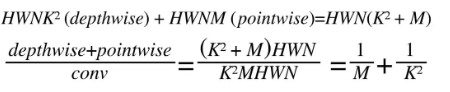

* 一般网络架构中M（输出特征通道数）>>K²（卷积核尺寸） (e.g. K=3 and M ≥ 32)，既深度可分离卷积计算量可显著降低标准卷积计算量的1/8–1/9。

* 深度可分离卷积思想是channel相关性和spatial相关性解耦图12。

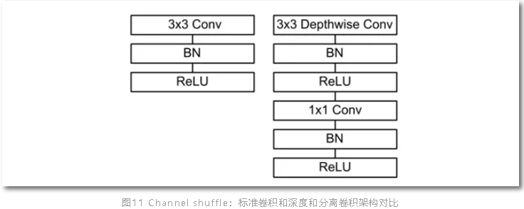

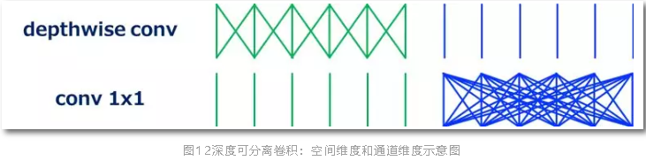

* 为了进一步降低Mobilenet v1计算量，对输入输出特征通道数M和N乘以宽度因子α(α∈(0,1),d典型值0.25,0.5和0.75),深度可分离卷积总计算量可以进一降低为：

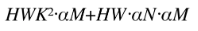

#### 2.2 ShuffleNet V1

* ShuffleNet是Face++提出的一种轻量化网络结构，主要思路是使用Group convolution和Channel shuffle改进ResNet，可以看作是ResNet的压缩版本。

* 图13展示了ShuffleNet的结构，其中(a)就是加入BatchNorm的ResNet bottleneck结构，而(b)和(c)是加入Group convolution和Channel Shuffle的ShuffleNet的结构。

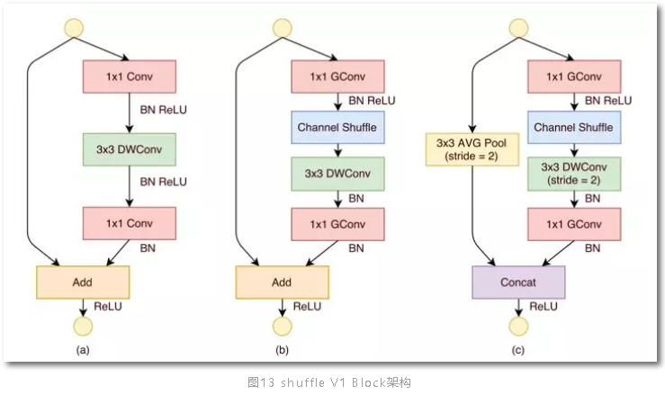

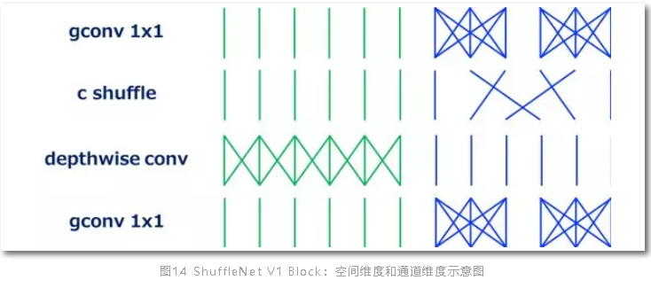

* 如所示，ShuffleNet block最重要的操作是channel shuffle layer，在两个分组卷积之间改变通道的顺序，channel shuffle实现分组卷积的信息交换机制。

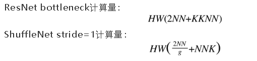

* 对比可知，ShuffleNet和ResNet结构可知，ShuffleNet计算量降低主要是通过分组卷积实现。ShuffleNet虽然降低了计算量，但是引入两个新的问题：

1、channel shuffle在工程实现占用大量内存和指针跳转，这部分很耗时。

2、channel shuffle的规则是人工设计，分组之间信息交流存在随意性，没有理论指导。

#### 2.3 MobileNet V2

* MobileNet V1设计时参考传统的VGGNet等链式架构，既传统的“提拉米苏”式卷积神经网络模型，都以层叠卷积层的方式提高网络深度，从而提高识别精度。但层叠过多的卷积层会出现一个问题，就是梯度弥散(Vanishing)。残差网络使信息更容易在各层之间流动，包括在前向传播时提供特征重用，在反向传播时缓解梯度信号消失。于是改进版的MobileNet V2增加skip connection，并且对ResNet和Mobilenet V1基本Block如下改进：
  * 继续使用Mobilenet V1的深度可分离卷积降低卷积计算量。
  * 增加skip connection，使前向传播时提供特征复用。
  * 采用Inverted residual block结构。该结构使用Point wise convolution先对feature map进行升维，再在升维后的特征接ReLU，减少ReLU对特征的破坏。

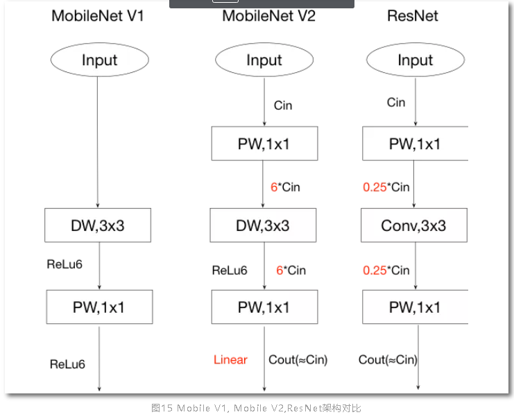

#### 2.4 ShuffleNet V2

* Mobile V1&V2，shuffle Net V1 在评价维度的共同特征是：使用FLOPS作为模型的评价标准，但是在移动终端设备时需要满足各个条件：参数少、速度快和精度高，单一的参数少并不一定实现速度快和精度高。

* Face++提出的ShuffeNet V2，实现使用直接指标（运算速度）代替间接评价指标（例如FLOPS），并在ARM等移动终端进行评估。并且基于减少计算量提出四个原则：

（1）使用输入和输出通道宽度不同增加卷积的计算量；

（2）组卷积增加MAC；

（3）多分支降低运算效率；

（4）元素级运算增加计算量。

如图16所示

（a）ShuffleNet 基本单元；

（b）用于空间下采样 (2×) 的 ShuffleNet 单元；

（c）ShuffleNet V2 的基本单元；

（d）用于空间下采样 (2×) 的 ShuffleNet V2 单元。

* ShuffleNet V2 引入通道分割（channel split）操作, 将输入的feature maps分为两部分：一个分支为shortcut流，另一个分支含三个卷积（且三个分支的通道数一样）。分支合并采用拼接（concat），让前后的channel数相同，最后进行Channel Shuffle（完成和ShuffleNet V1一样的功能）。元素级的三个运算channel split、concat、Channel Shuffle合并一个Element-wise，显著降低计算复杂度。

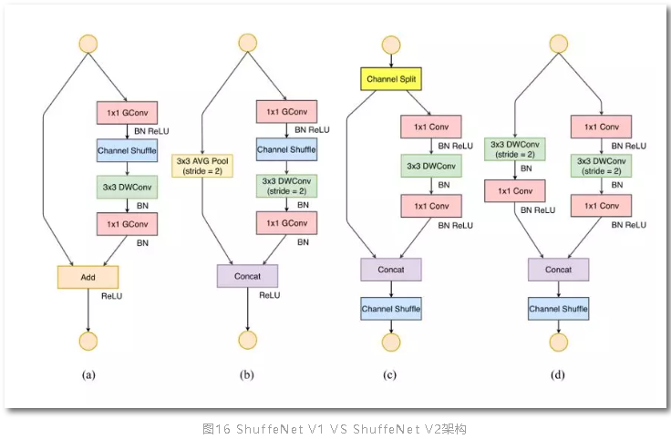

* ShuffleNet V2虽然提出减少计算量的四个原则，基本卷积单元仍采用Depthwise和Pointwise降低计算量，但是没有提出如何实现提高准确率，推断延迟等评价指标。

* 对比MobileNet V1&V2，ShuffleNet V1&V2模型（图17），手工设计轻量化模型主要得益于depth-wise convolution减少计算量，而解决信息不流畅的问题，MobileNet 系列采用了 point-wise convolution，ShuffleNet 采用的是 channel shuffle。

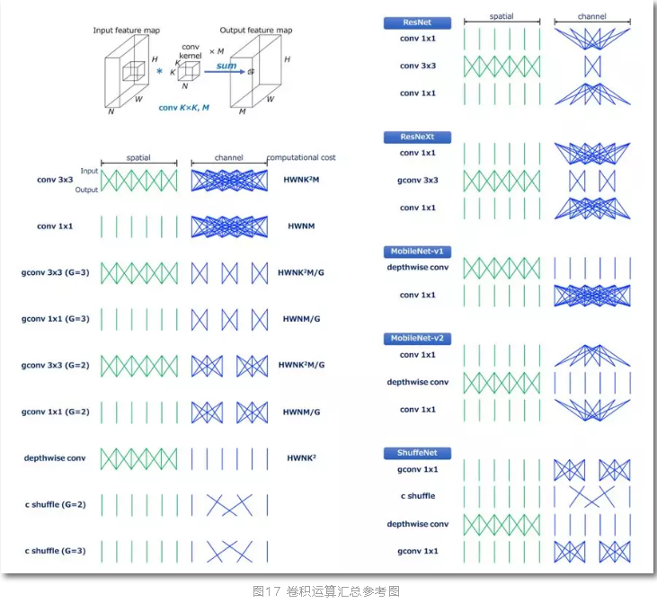

### 3、NAS与神经网络架构搜索

* 卷积神经网络（CNN）已被广泛用于图像分类、人脸识别、目标检测和其他领域。然而，为移动设备设计 CNN 是一项具有挑战性的工作，因为移动端模型需要体积小、速度快，还要保持精准。尽管人们已经做了大量努力来设计和改进移动端模型，第二章所总结MobileNet系列、ShuffleNet系列。但手动设计高效模型仍然是一项挑战，因为要考虑的因素太多。AutoML神经架构搜索的发展促进移动端 CNN 模型的自动化设计。

* NAS的算法综述可参看本人之前写的一篇综述文章《让算法解放算法工程师----NAS综述》。在综述文章中有关NAS的搜索空间，搜索策略，性能评估策略均已经做了总结，而且NAS的复现比较耗费GPU资源（NasNet做实验时间使用500块GPUx4天，一般项目组的资源难以望其项背），本章节主要是比较NAS设计的网络与传统手工设计神经网络异同，以及NAS的发展方向。

#### 3.1 NasNet

* NasNet是基于AutoML方法，首先在CIFAR-10这种小数据集上进行神经网络架构搜索，以便 AutoML 找到最佳卷积层并灵活进行多次堆叠来创建最终网络，并将学到的最好架构迁移到ImageNet图像分类和 COCO 对象检测中。NAS在搜索时使用的基本运算如下，包括常用的depthwise-separable,pool,3x3卷积等，使得block运行时对输入尺寸没有要求(例如卷积，pooling等操作)。这样图像由cifar的32 x32到imagenet的大尺寸图片均可实现分类任务。

* NasNet设计基于人类的经验，设计两类 Cells：Normal cell 和Reduction cell(图 19) 。Normal cell不改变输入feature map的大小的卷积， 而reduction cell将输入feature map的长宽各减少为原来的一半的卷积，是通过增加stride的大小来降低size。通过NasNet构建堆叠模块（cells）的深度实现架构的设计。

  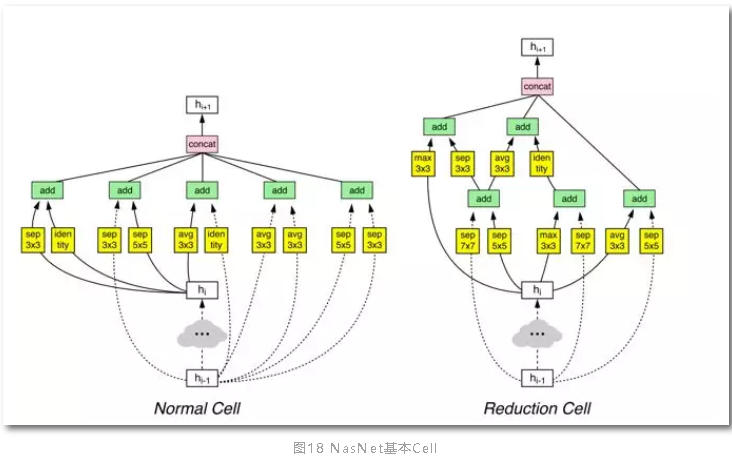

* NasNet首先基于人类的一些先验知识：卷积运算类型、Cell连接方式，Cell内的多分支拓扑结构，这些是积木。NasNet的搜索算法就是搭积木的过程，不断尝试各种可行的架构，通过代理评价指标确定模型的性能，实现全局最优搜索。

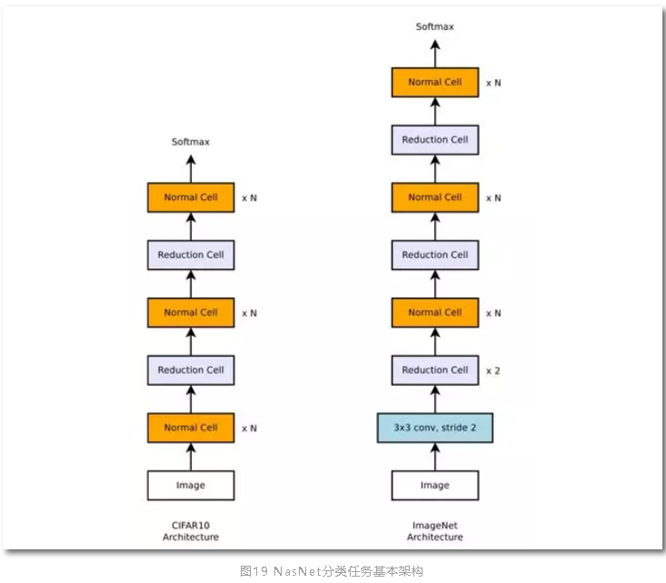

#### 3.2 MnasNet

* MnasNet是Google提出的探索了一种使用强化学习设计移动端模型的自动化神经架构搜索方法，并且实现准确率和运算速率突破。MnasNet 能够找到运行速度比 MobileNet V2快 1.5 倍、比 NASNet 快 2.4 倍的模型，同时达到同样的 ImageNet top-1 准确率。

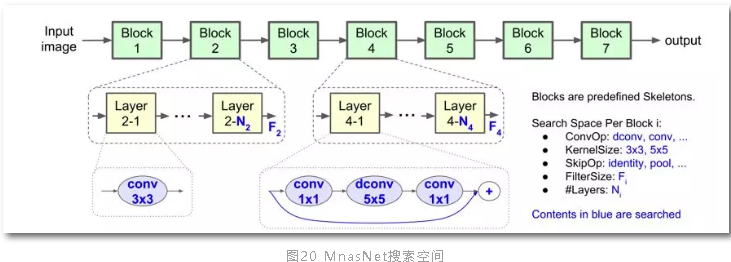

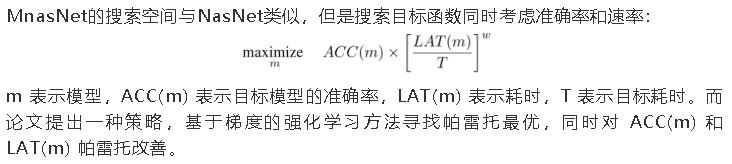

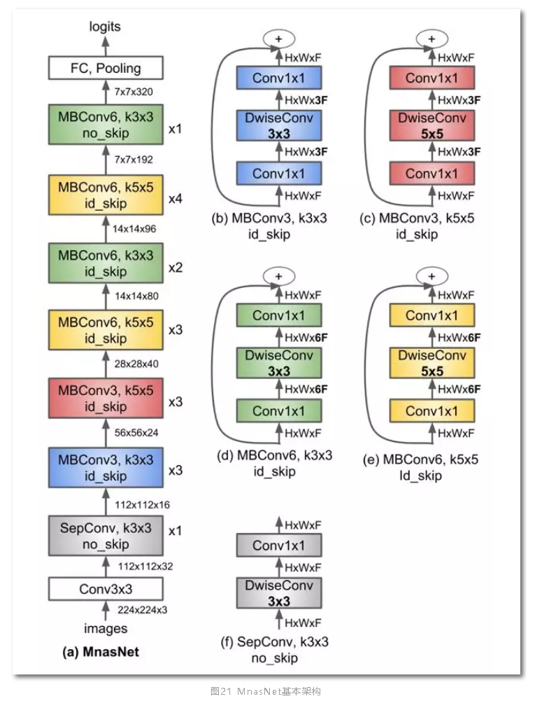

* 如图21显示了 MnasNet 算法的神经网络架构，包含一系列线性连接 blocks，每个 block 虽然包含不同类别的卷积层，每一卷积层都包含 depthwise convolution 卷积操作，最大化模型的计算效率。但是和 MobileNet V1&V2 等算法有明显不同：

  1、模型使用更多 5x5 depthwise convolutions。

  2、层分级的重要性。很多轻量化模型重复 block 架构，只改变滤波器尺寸和空间维度。论文提出的层级搜索空间允许模型的各个 block 包括不同的卷积层。

  3、论文使用强化学习的思路，首先确定了 block 的连接方式，在每个 block 使用层级搜索空间，确定每个卷积层的卷积类型，卷积核、跳跃层连接方式，滤波器的尺寸等。其基本策略还是延续人工设计神经网络思路。

#### 3.3 NAS发展方向

* NAS的搜索空间有很大的局限性。目前NAS算法仍然使用手工设计的结构和blocks，NAS仅仅是将这些blocks堆叠。人工痕迹太过明显，NAS还不能自行设计网络架构。NAS的一个发展方向是更广泛的搜索空间，寻找真正有效率的架构，当然对搜索策略和性能评估策略提出更高的要求。

* 以google的NAS为基础，很多模型专注于优化模型的准确率而忽视底层硬件和设备，仅考虑准确率高的模型难以在移动终端部署。研究针对多任务和多目标问题的 NAS，基于移动端的多目标神经网络搜索算法，评价指标从准确率扩展到功耗、推断延时、计算复杂度、内存占用、FLOPs等指标，解决移动端实际应用问题。

* 目前的NAS发展是以分类任务为主，在分类任务设计的模型迁移到目标检测语义分割模型中。

* Google在Cloud AutoML不断发力，相比较而言之前的工作只是在图像分类领域精耕细作，如今在图像语义分割开疆扩土，在arxiv提交第一篇基于NAS（Neural network architecture）的语义分割模型[12]（DPC，dense prediction cell）,已经被NIPS2018接收，并且在Cityscapes，PASCAL-Person-Part，PASCAL VOC 2012取得state-of-art的性能（mIOU超过DeepLabv3+），和更高的计算效率（模型参数少，计算量减少）。

* 如果让强化学习自己选择模型的架构，比如 Encoder-Decoder，U-Net，FPN等，相信在目标检测、实体分割等领域会有更好的表现。

### 4、AutoML自动模型压缩

* CNN模型替代了传统人工设计（hand-crafted）特征和分类器，不仅提供了一种端到端的处理方法，不断逼近计算机视觉任务的精度极限的同时，其深度和尺寸也在成倍增长。工业界不仅在设计轻量化模型（MobileNet V1&V2，ShuffleNet V1&V2系列），也在不断实践如何进一步压缩模型，在便携式终端设备实现准确率、计算速率、设备功耗、内存占用的小型化。

* CNN模型压缩是在计算资源有限、能耗预算紧张的移动设备上有效部署神经网络模型的关键技术。本文简介概述CNN模型压缩主流算法，重点介绍如何实现基于AutoML的模型压缩算法。

#### 4.1 CNN模型压缩概述

* CNN模型压缩是从压缩模型参数的角度降低模型的计算量。

* 在第2节介绍的人工设计轻量型神经网络结构，多是依赖Grouped Convlution、Depthwise、Pointwise、Channel Shuffle这些基本单元组成的Block，但是这些设计方法存在偶然性，不是搜索空间的最优解。

* 韩松提出的Deep compression获得 ICLR2016年的best paper，也是CNN模型压缩领域经典之作。论文提出三种方法：剪枝、权值共享和权值量化、哈夫曼编码。剪枝就是去掉一些不必要的网络权值，只保留对网络重要的权值参数；权值共享就是多个神经元见的连接采用同一个权值，权值量化就是用更少的比特数来表示一个权值。对权值进行哈夫曼编码能进一步的减少冗余。 作者在经典的机器学习算法，AlexNet和VGG-16上运用上面这些模型压缩的方法，在没有精度损失的情况下，把AlexNet模型参数压缩了35倍，把VGG模型参数压缩了49倍，并且在网络速度和网络能耗方面也取得了很好的提升。

* CNN模型压缩沿着Deep compression的思路，压缩算法可分为四类：参数修剪和共享、低秩分解、迁移/压缩卷积滤波器和知识蒸馏等。基于参数修剪（parameter pruning）和共享的方法关注于探索模型参数中冗余的部分，并尝试去除冗余和不重要的参数。基于低秩分解（Low-rank factorization）技术的方法使用矩阵/张量分解以估计深层 CNN 中最具信息量的参数。基于迁移/压缩卷积滤波器（transferred/compact convolutional filters）的方法设计了特殊结构的卷积滤波器以减少存储和计算的复杂度。而知识精炼（knowledge distillation）则学习了一个精炼模型，即训练一个更加紧凑的神经网络以再现大型网络的输出结果。

#### 4.2 AMC

* 传统的模型压缩技术依赖手工设计的启发式和基于规则的策略，需要算法设计者探索较大的设计空间，在模型大小、速度和准确率之间作出权衡，而这通常是次优且耗时的。西安交通大学与Google提出了适用于模型压缩的AMC[8]（AutoML for Model Compres- sion，AMC），利用强化学习提供模型压缩策略。

* 这种基于学习的压缩策略性能优于传统的基于规则的压缩策略，具有更高的压缩比，在更好地保持准确性的同时节省了人力成本。

##### 1、Problem Definition

* 模型压缩在维度上可分为Fine-grained pruning和Coarse-grained/structured pruning。Fine-grained pruning主要实现剪枝权重的非重要张量，实现非常高的压缩率同时保持准确率。Coarse-grained pruning旨在剪枝权重张量的整个规则区域（例如，通道，行，列，块等），例如在MobileNet V1&V2均存在宽度因子α对通道特征进行瘦身，但是宽度因子α对每一层的通道特征都固定比率压缩。

* 假设权重张量是n x c x k x k，c,n分别是输入输出通道数，k是卷积核尺寸。对于fine-grained pruning，稀疏度定义为零元素的数量除以总元素的数量既zeros/(n x c x k x h)，而channel pruning，权重张量缩小为n x c’ x k x k，既稀疏度为c’/c。

* 但是压缩模型的精度对每层的稀疏性非常敏感，需要细粒度的动作空间。因此，论文在一个离散的空间上搜索，而是通过 DDPG agent 提出连续压缩比控制策略（图 20），通过反复试验来学习：在精度损失时惩罚，在模型缩小和加速时鼓励。actor-critic 的结构也有助于减少差异，促进更稳定的训练。

  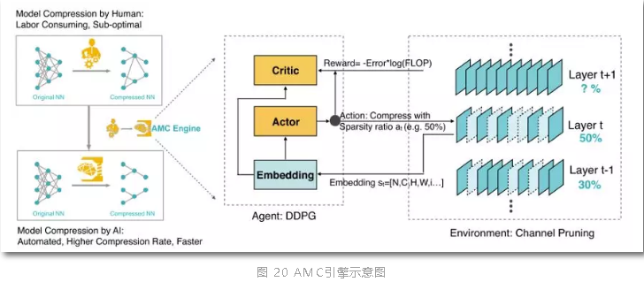

#### 2、搜索空间

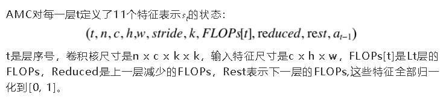