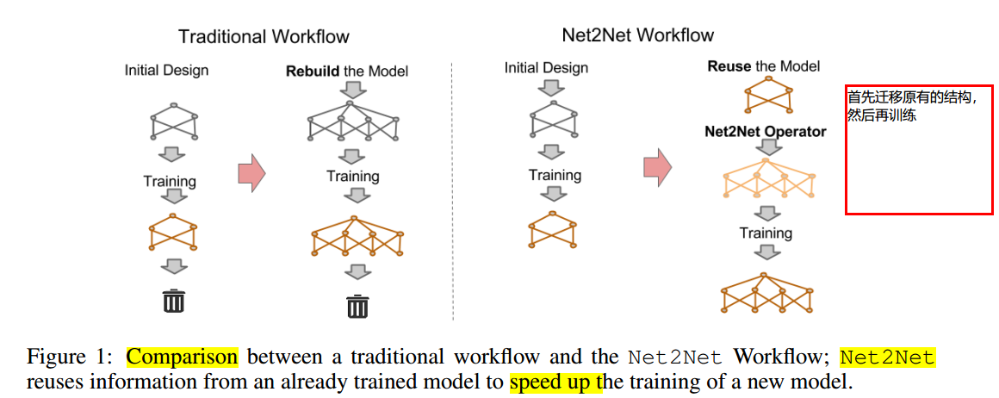
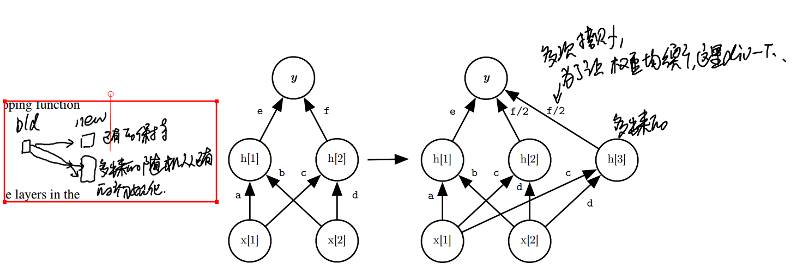
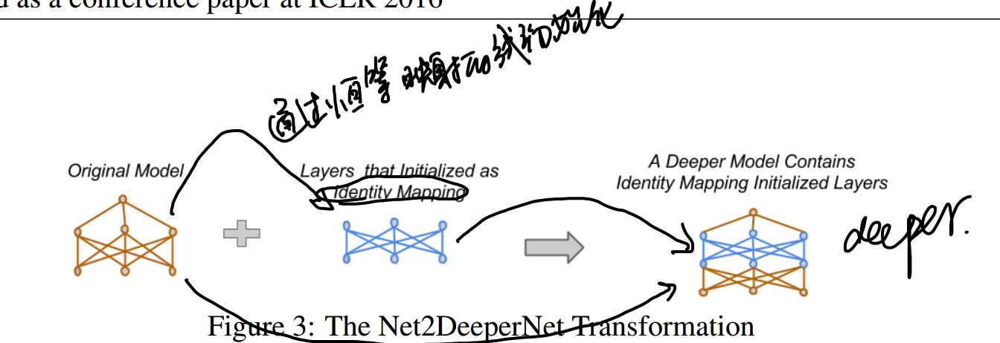

# 加速模型训练的各种方式

### 《2016-Net2Net- Accelerating Learning via Knowledge Transfer》
* [paper](paper/2016-Net2Net-%20Accelerating%20Learning%20via%20Knowledge%20Transfer.pdf)

### 动机

* 在实验阶段可能需要尝试多个model，每次都需要重新训练，这里提出一种新的思路，在已有的模型的基础上训练，而不是每次都重新开始。

* 机器学习系统是一个终身学习系统，我们可以通过这种迁移的方式，不断调整网络。
* 每个新提出模型，都是在原有基础上的改进，但是需要从头训练，很消耗资源。

### 创新

* 我们介绍一种技术，快速迁移存储在一个神经网络里的信息到另一个神经网络。
* 训练学生网络更快，如果可以通过减少在同一个任务中已经训练的教师网络的信息。
* 我们将学生初始化为一个神经网络，代表与教师相同的功能，但使用不同的参数化。
* 在初始化较大网络以包含先前由较小网络获取的所有知识之后，可以训练较大网络以改善其性能。

### 网络结构

* 两种改变方式：
  * Net2WiderNet: 代替模型通过相同但是更宽的model。
  * Net2DeeperNet：代替模型通过一些性质相同但是更深的网路。

* 变宽模式：

  

* 变深模式：

  

### 《FITNETS: HINTS FOR THIN DEEP NETS》
* [paper](paper/2015-FITNETS%20HINTS%20FOR%20THIN%20DEEP%20NETS.pdf)
* 利用教师网路的中间层去指导学生网络的中间层结果，然后得到的结果一样，但是学生网络更简单。